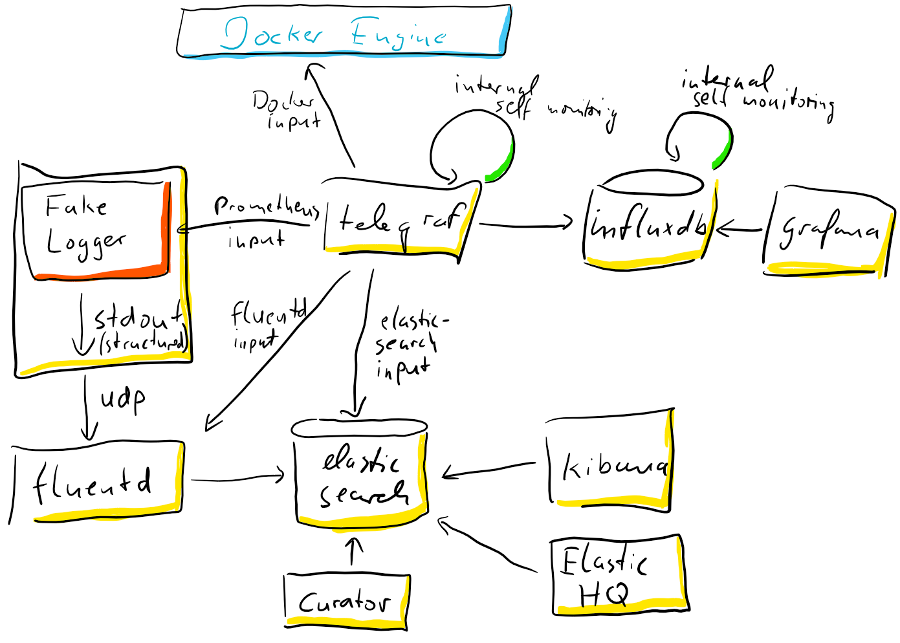

# Logging in containerized environments

This setup is an attempt to run the ELF stack scenario using the 12 factor approach of stdout logging to feed fluentd.

## Involved Components

- `./src/fake-logger` - a simple dotnet core app that produces some random **structured** log events on stdout and metrics using the prometheus client
- Application Lifecycle Logging
  - [Fluentd](https://www.fluentd.org/) as unified logging gateway
  - [Elasticsearch](https://www.elastic.co/products/elasticsearch) for storage and indexing of logging data
  - [Kibana](https://www.elastic.co/products/kibana) for analysing the logging data
- Application Telemetrie
  - [Prometheus dotnet Client](https://github.com/prometheus-net/prometheus-net) to expose an HTTP endpoint for metrics
  - [Telegraf](https://www.influxdata.com/time-series-platform/telegraf/) to collect metrics of all containers involved
  - [InfluxDB](https://www.influxdata.com/time-series-platform/influxdb/) to store metrics data
  - [Grafana](https://grafana.com/) to analyse metrics data



## Run it

```bash
docker-compose up -d
# wait...
# open Grafana on http://localhost:3000
# open Kibana on http://localhost:5601
```
